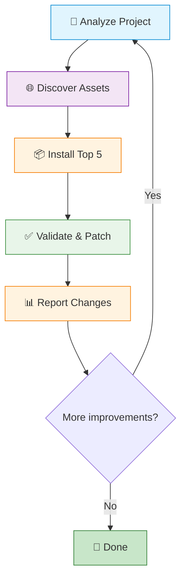
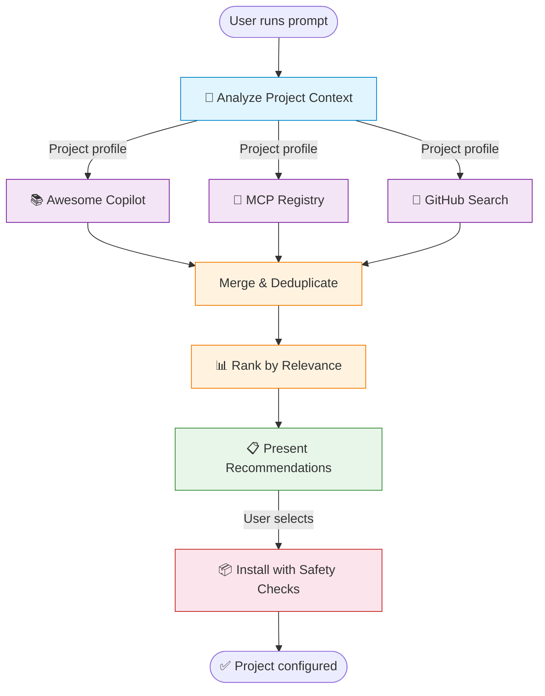

# 🔥 CopilotForge

> **The meta-agent that forges your perfect AI coding setup — and keeps improving it.**

Auto-discovers, installs, validates, and self-improves GitHub Copilot agents, skills, prompts, instructions, and MCP servers for any project.

[](https://docs.github.com/en/copilot)
[](LICENSE)


---

## ⚡ Use on any project — 3 steps

CopilotForge installs **once** and then works across all your projects. You do not need to clone or copy anything into each project.

**Step 1 — Clone and build (one time only)**

```bash
git clone https://github.com/g-mercuri/copilot-forge.git ~/copilot-forge
cd ~/copilot-forge/mcp-server && npm install && npm run build
```

**Step 2 — Register the MCP server globally in VS Code**

Open the VS Code command palette (`Ctrl+Shift+P` / `Cmd+Shift+P`) → **"MCP: Edit User Configuration"** and add:

```json
{
  "servers": {
    "copilot-forge": {
      "type": "stdio",
      "command": "node",
      "args": ["/absolute/path/to/copilot-forge/mcp-server/dist/index.js"]
    }
  }
}
```

> Replace `/absolute/path/to/copilot-forge` with the actual path where you cloned the repo.

**Step 3 — Open any project and run in Copilot Chat (Agent Mode)**

```
Generate instructions for this project
```

Or run the full autopilot:

```
/autopilot-improve
```

That's it. CopilotForge reads your current workspace, analyzes the codebase, and generates or installs the right Copilot setup for it.

---

## 💡 The Pitch

**What if your AI coding assistant could make itself smarter?**

CopilotForge analyzes your project, searches the entire Copilot ecosystem, and installs the exact skills, agents, and tools your stack needs. Then it validates what it installed. Then it does it again. **Each iteration makes Copilot more powerful for your specific project.**

No more browsing READMEs. No more manual `.github/` setup. No more guessing which MCP servers matter. CopilotForge handles the full lifecycle — discovery, installation, validation, and continuous improvement — so you can focus on building.

### ⚡ NEW: Three Killer Features

| Feature | What it does | Who it's for |
|---------|-------------|--------------|
| 🧬 **`generate_instructions`** | Deep-scans your code for naming conventions, error handling, imports, architecture — generates a project-specific `copilot-instructions.md` in seconds | Every developer |
| 📊 **`score_setup`** | Rates your Copilot setup 0-10 with letter grade, identifies gaps, suggests fixes | Teams wanting to level up |
| 🏢 **`generate_org_standards`** | Generates org-wide instruction files (naming policy, security rules, testing standards, commit conventions) from your codebase patterns | GitHub Enterprise teams |

---

## 🧬 Generate Instructions — "Make Copilot Understand Your Codebase"

The most impactful single feature. Run it on any project and get a comprehensive `copilot-instructions.md` in seconds.

### What It Detects

| Category | Examples |
|----------|---------|
| **Naming conventions** | camelCase vars, kebab-case files, UPPER_SNAKE constants, PascalCase types |
| **Error handling** | try-catch vs Result types, custom error classes, error message style |
| **Import style** | Named vs default, file extensions, barrel exports, path aliases, sorted imports |
| **Function style** | Arrow vs declarations, async/await, early returns |
| **Testing patterns** | Framework (Vitest/Jest/etc), describe-it vs flat test, mocking approach |
| **Architecture** | Layer-based vs feature-based, source/test directory structure |
| **Code style** | Semicolons, quotes, indentation, trailing commas |
| **Dependencies** | Preferred libraries for validation, HTTP, ORM, logging, CSS, auth |

### Usage

```
Generate instructions for this project
```

Or use the MCP tool directly:
```
generate_instructions(project_path: "/path/to/project", confirm: false)  // preview
generate_instructions(project_path: "/path/to/project", confirm: true)   // write
```

---

## 📊 Score Setup — "Your Copilot Setup is 3/10"

Gamified evaluation that drives adoption. Creates urgency and sharing.

### Categories Scored

| # | Category | Points | What It Checks |
|---|----------|--------|---------------|
| 1 | copilot-instructions.md | 0-2 | Exists and is comprehensive (>200 chars) |
| 2 | Coding standards | 0-1 | Instructions cover naming and style |
| 3 | Error handling | 0-1 | Error handling patterns documented |
| 4 | Testing practices | 0-1 | Testing framework and patterns documented |
| 5 | Language instructions | 0-1 | Stack-specific instruction files exist |
| 6 | Security/governance | 0-1 | Security rules for AI documented |
| 7 | Prompts | 0-1 | Reusable prompt files exist |
| 8 | Agents/skills | 0-1 | Custom agents or skills configured |
| 9 | Commit conventions | 0-1 | Commit message standards documented |

Returns a letter grade (F → A+), progress bar, and prioritized quick wins.

---

## 🏢 Enterprise: Org Standards Generator

For GitHub Enterprise teams that need consistent Copilot behavior across repositories.

### Generated Standards

| File | Scope | Contents |
|------|-------|---------|
| `naming-conventions.instructions.md` | `**` | Variable, function, file, constant naming rules with examples |
| `error-handling.instructions.md` | `**/*.ts, **/*.js, ...` | Error patterns, custom errors, message format |
| `testing-standards.instructions.md` | `**/*.test.*` | Framework, structure, mocking, coverage rules |
| `security-governance.instructions.md` | `**` | Input validation, auth, data safety, AI-specific rules |
| `commit-conventions.instructions.md` | `**` | Conventional commits spec with examples |
| `code-review-guidelines.instructions.md` | `**` | AI code review priorities and pair programming rules |

### How to Deploy at Org Level

1. Run `generate_org_standards` on a reference project
2. Copy the generated `.github/instructions/` to your org's `.github` repository
3. Every repo in the org inherits these standards automatically
4. Teams can override with repo-level instructions

This replaces manual style guides with **AI-enforced standards** — Copilot follows these rules in every suggestion, every review, every generation.

---

## 🔄 Autopilot Mode

This is CopilotForge's signature feature: a **self-improving loop** that iteratively enhances your Copilot setup.

### How to use it

```
/autopilot-improve
```

Or in Copilot Chat:

```
Run the autopilot to improve this project's Copilot setup
```

### What it does — the 6-phase loop

```
┌─────────────────────────────────────────────────────────────┐
│                                                             │
│   ANALYZE → DISCOVER → INSTALL → VALIDATE → PATCH → REPORT │
│      ↑                                              │       │
│      └──────────────── loop ────────────────────────┘       │
│                                                             │
└─────────────────────────────────────────────────────────────┘
```

| Phase | What happens |
|-------|-------------|
| **🔬 Analyze** | Deep-scan your project for languages, frameworks, dependencies, CI/CD, cloud providers, and architecture patterns |
| **🌐 Discover** | Search awesome-copilot, MCP Registry, GitHub topics, and community repos for assets matching your stack |
| **📦 Install** | Install the top-ranked assets into `.github/` with conflict detection and safety checks |
| **✅ Validate** | Verify installed assets — check `applyTo` globs, syntax, compatibility, and build integrity |
| **🔧 Patch** | Auto-fix any issues found during validation (e.g., wrong file globs, missing fields) |
| **📊 Report** | Summarize what changed, what improved, and what to target next iteration |

### Safety rules

- **Max 5 assets per iteration** — small, reviewable batches
- **Verified sources only** — trust badges on every asset
- **Never overwrites** — existing customizations are preserved
- **Git commit per iteration** — full traceability, easy rollback
- **Build validation** — ensures your project still compiles after changes

---

## 🧪 Dogfooding: How CopilotForge Improved Itself

We ran CopilotForge on its own repository. Here's what happened.

### Iteration 0 — Baseline

The project started with **8 customizations**: 1 agent, 5 skills, and 2 prompts. No coding instructions. No governance rules. No commit standards.

### Iteration 1 — Discovery

The agent analyzed the project and identified the stack: **TypeScript, MCP SDK, Vitest, Docker, GitHub Actions**. It searched the awesome-copilot catalog (550+ assets), matched **23 relevant candidates**, and ranked the top 5 for installation.

### Iteration 2 — Install

Five assets were installed:

| Asset | Type | Purpose |
|-------|------|---------|
| `copilot-instructions.md` | Instructions | Project-specific TypeScript and MCP conventions |
| `agent-safety.instructions.md` | Instructions | AI agent governance and safety guidelines |
| `nodejs-javascript-vitest.instructions.md` | Instructions | Vitest testing standards and best practices |
| `agent-governance` | Skill | Trust controls and permission boundaries for AI agents |
| `conventional-commit` | Skill | Standardized commit message formatting |

### Iteration 3 — Validate & Patch

The validator caught a bug: `nodejs-javascript-vitest.instructions.md` had `applyTo: '**/*.js'`, but the project is **100% TypeScript**. CopilotForge auto-patched the glob to include `**/*.ts`.

### Result

**8 → 15 customizations.** The agent now follows governance rules, writes better TypeScript, uses conventional commits, and catches its own configuration bugs.

---

## 🚀 Quick Start

> **New here?** See [⚡ Use on any project](#-use-on-any-project--3-steps) at the top — it's the fastest path.

### Available slash commands

| Command | Use Case |
|---------|----------|
| `/forge-init` | ⚡ One-command full setup (recommended) |
| `/discover-for-new-project` | 🆕 Full setup for new projects |
| `/discover-for-refactoring` | 🔄 Find gaps in existing setup |
| `/autopilot-improve` | 🔥 Iterative self-improvement loop |

### Option A: Forge Init (one command, full setup)

After completing the 3-step setup above, open your project in VS Code and run in Copilot Chat (Agent Mode):

```
/forge-init
```

This analyzes your codebase, generates custom instructions, scores your setup, and recommends improvements — all in one shot.

### Option B: Autopilot (iterative improvement)

```
/autopilot-improve
```

### Option C: One-shot discovery

In Copilot Chat:
```
Find the best skills and MCP servers for this project
```

Copilot calls `recommend_skills`, which runs `analyze_project`, `search_copilot_assets`, and `search_mcp_servers` in parallel, then deduplicates and ranks the results.

---

## 🔌 MCP Server Setup

CopilotForge runs as an MCP server. For the best experience, use it alongside the official **awesome-copilot** server.

| Server | Source | What It Provides |
|--------|--------|-----------------|
| **awesome-copilot** | [Microsoft](https://github.com/microsoft/mcp-dotnet-samples) | Official awesome-copilot catalog search |
| **copilot-forge** | This project | MCP Registry search, GitHub-wide search, project analysis, autopilot loop, trust layer |

### VS Code (`.vscode/mcp.json`)

```json
{
  "servers": {
    "awesome-copilot": {
      "type": "stdio",
      "command": "docker",
      "args": ["run", "-i", "--rm", "ghcr.io/microsoft/mcp-dotnet-samples/awesome-copilot:latest"]
    },
    "copilot-forge": {
      "type": "stdio",
      "command": "node",
      "args": ["${workspaceFolder}/mcp-server/dist/index.js"]
    }
  }
}
```

> **Windows / WSL Docker** — Replace the `awesome-copilot` command with:
> `"command": "wsl"`, `"args": ["docker", "run", "-i", "--rm", "ghcr.io/microsoft/mcp-dotnet-samples/awesome-copilot:latest"]`
> <a name="-wsl-docker-windows"></a>

### Claude Desktop (`claude_desktop_config.json`)

```json
{
  "mcpServers": {
    "awesome-copilot": {
      "command": "docker",
      "args": ["run", "-i", "--rm", "ghcr.io/microsoft/mcp-dotnet-samples/awesome-copilot:latest"]
    },
    "copilot-forge": {
      "command": "node",
      "args": ["/path/to/copilot-forge/mcp-server/dist/index.js"]
    }
  }
}
```

### Building Locally

```bash
cd mcp-server && npm install && npm run build
```

When using VS Code with the repo open, prefer `"${workspaceFolder}/mcp-server/dist/index.js"` so the path stays portable.

---

## 🛠️ MCP Tools

| Tool | R/W | Description |
|------|-----|-------------|
| `generate_instructions` 🧬 | **Write** | Deep-scan codebase → generate project-specific `copilot-instructions.md` |
| `score_setup` 📊 | Read | Evaluate Copilot setup quality — score, grade, gaps, fix suggestions |
| `generate_org_standards` 🏢 | **Write** | Generate org-wide instruction files from detected patterns (enterprise) |
| `recommend_skills` ⭐ | Read | Unified orchestrator — all sources, dedup, context-aware ranking |
| `autopilot_improve` 🔄 | Read | Run one autopilot iteration — analyze, discover, validate, patch |
| `search_copilot_assets` | Read | Search awesome-copilot catalog |
| `search_mcp_servers` | Read | Search MCP Registry |
| `analyze_project` | Read | Deep project scan |
| `get_asset_details` | Read | Asset details + trust badge |
| `install_asset` | **Write** | Preview-by-default install with conflict detection |

### MCP Resources

| Resource URI | Description |
|--------------|-------------|
| `discovery://trust-registry` | Current trust levels for known asset sources |
| `discovery://audit-log` | Log of all install operations (`~/.copilot-skills-discovery/audit.jsonl`) |
| `discovery://cache-status` | Discovery cache metadata |

---

## 🔒 Security

Every asset carries a **trust badge** before installation:

| Badge | Level | Sources |
|-------|-------|---------|
| ✅ **Verified** | High | `github/awesome-copilot`, `microsoft/*`, `anthropics/skills` |
| ⚠️ **Community** | Medium | GitHub repos with reasonable activity |
| ❌ **Unknown** | Low | Unrecognised or brand-new sources |

**Protection measures:** URL allowlist (GitHub + MCP Registry only), SSRF blocking, preview-by-default installs, content scanning for prompt injection, path traversal prevention, and a full audit log at `~/.copilot-skills-discovery/audit.jsonl`. All MCP tools declare `readOnlyHint`, `destructiveHint`, and `openWorldHint` annotations.

---

## 🏗️ Architecture

### Autopilot Loop



### Discovery Pipeline



### File Structure

```
.github/
├── agents/
│   └── copilot-discoverer.agent.md       # 🤖 Orchestrator agent
├── prompts/
│   ├── forge-init.prompt.md              # ⚡ One-command full setup
│   ├── discover-for-new-project.prompt.md # 🆕 New project workflow
│   ├── discover-for-refactoring.prompt.md # 🔄 Refactoring workflow
│   └── autopilot-improve.prompt.md        # 🔥 Self-improvement loop
└── skills/
    ├── analyze-project-context/           # 🔬 Deep project analysis
    ├── discover-from-awesome-copilot/     # 📚 Curated asset discovery
    ├── discover-from-github-search/       # 🔎 GitHub-wide search
    ├── discover-from-mcp-registry/        # 🔌 MCP server discovery
    └── install-discovered-assets/         # 📦 Safe asset installer

mcp-server/src/
├── analyzers/
│   └── pattern-detector.ts               # 🧬 Code pattern detection engine
├── tools/
│   ├── generate-instructions.ts          # 🧬 Auto-generate instructions
│   ├── score-setup.ts                    # 📊 Setup quality scoring
│   ├── generate-org-standards.ts         # 🏢 Enterprise standards generator
│   ├── recommend-skills.ts              # ⭐ Unified recommendation
│   ├── autopilot-improve.ts             # 🔄 Autopilot iteration
│   ├── install-asset.ts                 # 📦 Safe installer
│   └── ...
└── security/                             # 🔒 URL validation, content scanning
```

---

## 📊 Comparison

| Feature | 🔥 CopilotForge | awesome-copilot `suggest-*` | Manual Browsing |
|---------|:---------------:|:--------------------------:|:---------------:|
| **Auto-generate instructions** | ✅ | ❌ | ❌ |
| **Setup quality score** | ✅ | ❌ | ❌ |
| **Org standards generation** | ✅ | ❌ | ❌ |
| Deep project analysis | ✅ | ❌ | ❌ |
| Multi-source search | ✅ (4+ sources) | ⚠️ (1 source each) | ⚠️ (one at a time) |
| Context-aware ranking | ✅ | ⚠️ (basic) | ❌ |
| Automated installation | ✅ (with safety) | ❌ | ❌ |
| Conflict detection | ✅ | ❌ | ❌ |
| Post-install validation | ✅ | ❌ | ❌ |
| Auto-patching | ✅ | ❌ | ❌ |
| Autopilot loop | ✅ | ❌ | ❌ |
| One-command setup | ✅ (`/forge-init`) | ❌ | ❌ |

---

## 🔎 Sources Searched

| Source | What It Finds | Coverage |
|--------|--------------|----------|
| [**github/awesome-copilot**](https://github.com/github/awesome-copilot) | Curated agents, skills, prompts, instructions | Official community list (23K+ ⭐) |
| [**MCP Registry**](https://registry.modelcontextprotocol.io) | MCP servers for databases, APIs, cloud services | Official Model Context Protocol registry |
| **GitHub Search** | Community repos via topic tags and code search | The entire GitHub ecosystem |
| **Community Repos** | Specialized collections (`awesome-copilot-agents`, etc.) | Extended community curation |

---

## 🧪 CI & Testing

Tested on Node.js 20 and 22 via GitHub Actions — TypeScript compilation, ESLint, 137 unit tests (Vitest), and `npm audit`.

---

## 🤝 Contributing

- 🐛 **Report bugs** — Open an issue
- 💡 **Suggest features** — New discovery sources, workflow ideas, autopilot improvements
- 🔧 **Submit PRs** — Improve skills, ranking algorithms, or validation logic
- 📖 **Improve docs** — Clearer instructions, more examples

Please open an issue before submitting large changes.

---

## 📄 License

[MIT License](LICENSE)

---

<p align="center">
  <strong>🔥 CopilotForge</strong> — Forge your perfect AI coding setup<br>
  Built with ❤️ for the GitHub Copilot community
</p>
